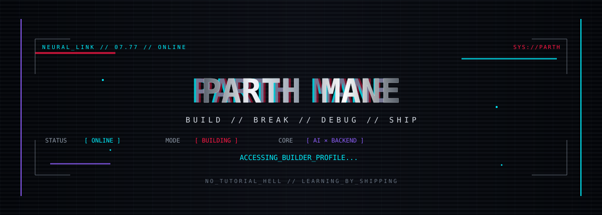

<div align="center">



<br>


<br><br>


</div>
---
<pre style="text-align: center;">
┌──────────────────────────────────────────────────────────────────────────────┐
│                                  PARTH MANE                                  │
│                                                                              │
│                         computer engineering student                         │
│               building AI-powered products + backend systems                 │
│                                                                              │
│      AI       ──►       BACKEND       ──►       FULL-STACK       ──►   DSA   │
└──────────────────────────────────────────────────────────────────────────────┘
</pre>

I like building software more than talking about building software.

Most of what I know came from trying to build something, getting stuck, figuring out why it broke, fixing it, and doing it again.

Currently going deeper into **backend engineering, AI systems, APIs, databases and deployment.**

---

## `01 / PROJECTS`

### `ELECTION PLAYBOOK`

AI-powered civic-tech platform for structured analysis and verification of political information.

`Next.js` `TypeScript` `Gemini` `Tailwind CSS`

---

### `CAMPUS AI ASSISTANT`

AI-focused student platform built during a buildathon, combining productivity workflows, resume analysis and campus tools.

`React` `Node.js` `MongoDB` `Gemini` `Monad`

---

### `PROMPTFORGE`

Developer tool for turning large repositories into structured, LLM-friendly context without blindly dumping the entire codebase.

`React` `Vite` `JavaScript`

---

### `DSA`

```text
C++

arrays          ██████████
binary search   █████████
trees           ███████
graphs          ██████
DP              █████

100+ problems solved
```

---

## `02 / STACK`

<div align="center">

### LANGUAGES

`C++` · `JavaScript` · `TypeScript` · `Python`

### FRONTEND

`React` · `Next.js` · `Vite` · `Tailwind CSS`

### BACKEND

`Node.js` · `Express.js` · `REST APIs`

### AI

`Gemini` · `OpenAI` · `LLM APIs` · `Prompt Engineering`

### TOOLS

`Git` · `GitHub` · `Docker` · `Postman` · `Vercel`

</div>

---

## `03 / CURRENTLY BUILDING`

```text
API DESIGN
      ↓
DATABASES
      ↓
AUTHENTICATION
      ↓
BACKEND ARCHITECTURE
      ↓
AI INTEGRATION
      ↓
DOCKER
      ↓
DEPLOYMENT
```

Trying to get really good at the boring stuff behind the cool stuff.

Because making a chatbot is one thing.

Making the **whole product actually work** is another.

---

## `04 / OPERATING SYSTEM`

```text
┌─────────────────────────────────────────────────────────────────────┐
│                                                                     │
│  INPUT       idea                                                   │
│     ↓                                                               │
│  PROCESS     build → break → debug                                  │
│     ↓                                                               │
│  OUTPUT      ship                                                    │
│     ↓                                                               │
│  LOOP        repeat                                                  │
│                                                                     │
└─────────────────────────────────────────────────────────────────────┘
```

I learn fastest when there's something real to build.

Hackathons, build events, open source, developer communities and side projects are usually where I end up experimenting next.

---

## `05 / 2026`

```text
[x] 100+ DSA problems
[x] build AI projects
[x] participate in hackathons
[x] start contributing to open source
[x] ship more projects

[ ] become genuinely strong at backend engineering
[ ] go deeper into AI systems
[ ] ship something people keep using
[ ] build something worth obsessing over
```

---

## `06 / TELEMETRY`

<div align="center">


<br><br>


</div>

---

<div align="center">


<br>

`BUILD → BREAK → DEBUG → SHIP`

</div>
